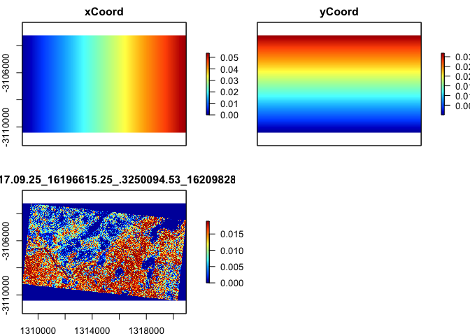

readme
================
Andrew
8/18/2022

# Summary

Demonstrate a workflow / use case for passive acoustic monitoring data,
with GDM

## Introduction

## Methods

Model 1:

The CSV files generated were imported into R. GDM was conducted using
environmental data collected from the recording locations, to determine
if compositional disimilarity was related to changes in habitat metrics.
Distance to water source was calculated as a distance in meters from
each study site location, based on the QLD waterways spatial layer.

Model 2:

A model was also conducted with raster layer spatial data obtained from
the Sentinel hub platform. To determine the relationships with remotely
sensed data (vegetation/greenness indices) and variation in
compositional dissimilarity of bird species at the property. The indices
used were SAVI and NDVI.

Satellite images were used for the dates (what dates) when the study
took place (iamges with cloud cover 0%).

## Results

Species frequency table:

    ## # A tibble: 68 × 10
    ##    common_name              IM01  IM02  IM03  OM01  OM02  OM03  RM01  RM02  RM03
    ##    <chr>                   <int> <int> <int> <int> <int> <int> <int> <int> <int>
    ##  1 Australian Magpie          50     8     4     9    32    86     5     1    32
    ##  2 Australian Raven           84    39    51    24    41    28    31    25    26
    ##  3 Australian Ringneck        37     1     9    40     7     6     2     6     5
    ##  4 Bar-shouldered Dove        25     2     1    NA     4     1     2    NA     1
    ##  5 Black-faced Cuckoo-shr…     3     2    NA    NA     4     1     1     2    NA
    ##  6 Brown Treecreeper          15     1     3    NA    34   149    NA    NA    NA
    ##  7 Chestnut-rumped Thornb…   119    59   112   121   103    15    28    30    34
    ##  8 Crested Bellbird           27    28     7     6    19    88    23    11    18
    ##  9 Crested Pigeon              4     2     5     1     6     2    NA     1     1
    ## 10 Diamond Dove                2     1     5    NA     8    NA    NA     1     2
    ## # … with 58 more rows

### GDM model 1

#### Detections vs vegetation survey data

    ## tibble [7,250 × 18] (S3: tbl_df/tbl/data.frame)
    ##  $ tag_number : chr [1:7250] "158" "169" "159" "102" ...
    ##  $ common_name: chr [1:7250] "Red-browed Pardalote" "Rufous Whistler" "Red-capped Robin" "Hall's Babbler" ...
    ##  $ X          : num [1:7250] 1311855 1311855 1311855 1311855 1311855 ...
    ##  $ Y          : num [1:7250] -3107657 -3107657 -3107657 -3107657 -3107657 ...
    ##  $ fid        : int [1:7250] 1 1 1 1 1 1 1 1 1 1 ...
    ##  $ point_name : chr [1:7250] "int_growth1" "int_growth1" "int_growth1" "int_growth1" ...
    ##  $ treatment  : chr [1:7250] "intermediate" "intermediate" "intermediate" "intermediate" ...
    ##  $ lat        : num [1:7250] -28 -28 -28 -28 -28 ...
    ##  $ lon        : num [1:7250] 146 146 146 146 146 ...
    ##  $ site_code  : chr [1:7250] "IM01" "IM01" "IM01" "IM01" ...
    ##  $ tree_cover : num [1:7250] 32.2 32.2 32.2 32.2 32.2 32.2 32.2 32.2 32.2 32.2 ...
    ##  $ tree_heigh : num [1:7250] 7.55 7.55 7.55 7.55 7.55 7.55 7.55 7.55 7.55 7.55 ...
    ##  $ DBH        : num [1:7250] 24 24 24 24 24 ...
    ##  $ shrub_heig : num [1:7250] 2.56 2.56 2.56 2.56 2.56 ...
    ##  $ shrub_cove : num [1:7250] 12.2 12.2 12.2 12.2 12.2 12.2 12.2 12.2 12.2 12.2 ...
    ##  $ area       : num [1:7250] 123642 123642 123642 123642 123642 ...
    ##  $ HubName    : chr [1:7250] "Watercourse" "Watercourse" "Watercourse" "Watercourse" ...
    ##  $ HubDist    : num [1:7250] 10101 10101 10101 10101 10101 ...
    ## [1] "Site weighting type: Equal"
    ## [1] "Site-pair table created with 36 rows (9 unique sites) and 16 columns (5 environmental variables)."

    ## [1] 
    ## [1] 
    ## [1] GDM Modelling Summary
    ## [1] Creation Date:  Thu Sep 15 15:50:18 2022
    ## [1] 
    ## [1] Name:  gdm_01
    ## [1] 
    ## [1] Data:  gdmTab
    ## [1] 
    ## [1] Samples:  36
    ## [1] 
    ## [1] Geographical distance used in model fitting?  TRUE
    ## [1] 
    ## [1] NULL Deviance:  0.638
    ## [1] GDM Deviance:  0.465
    ## [1] Percent Deviance Explained:  27.159
    ## [1] 
    ## [1] Intercept:  0.206
    ## [1] 
    ## [1] PREDICTOR ORDER BY SUM OF I-SPLINE COEFFICIENTS:
    ## [1] 
    ## [1] Predictor 1: tree_cover
    ## [1] Splines: 3
    ## [1] Min Knot: 0
    ## [1] 50% Knot: 37.3
    ## [1] Max Knot: 74
    ## [1] Coefficient[1]: 0.092
    ## [1] Coefficient[2]: 0.018
    ## [1] Coefficient[3]: 0
    ## [1] Sum of coefficients for tree_cover: 0.11
    ## [1] 
    ## [1] Predictor 2: DBH
    ## [1] Splines: 3
    ## [1] Min Knot: 5.867
    ## [1] 50% Knot: 23.95
    ## [1] Max Knot: 48.92
    ## [1] Coefficient[1]: 0
    ## [1] Coefficient[2]: 0.033
    ## [1] Coefficient[3]: 0.004
    ## [1] Sum of coefficients for DBH: 0.037
    ## [1] 
    ## [1] Predictor 3: Geographic
    ## [1] Splines: 3
    ## [1] Min Knot: 645.027
    ## [1] 50% Knot: 4050.635
    ## [1] Max Knot: 8523.845
    ## [1] Coefficient[1]: 0.004
    ## [1] Coefficient[2]: 0.017
    ## [1] Coefficient[3]: 0
    ## [1] Sum of coefficients for Geographic: 0.021
    ## [1] 
    ## [1] Predictor 4: shrub_heig
    ## [1] Splines: 3
    ## [1] Min Knot: 0.5
    ## [1] 50% Knot: 2.169
    ## [1] Max Knot: 3.24
    ## [1] Coefficient[1]: 0
    ## [1] Coefficient[2]: 0
    ## [1] Coefficient[3]: 0.012
    ## [1] Sum of coefficients for shrub_heig: 0.012
    ## [1] 
    ## [1] Predictor 5: tree_heigh
    ## [1] Splines: 3
    ## [1] Min Knot: 0
    ## [1] 50% Knot: 7.55
    ## [1] Max Knot: 13.9
    ## [1] Coefficient[1]: 0
    ## [1] Coefficient[2]: 0
    ## [1] Coefficient[3]: 0
    ## [1] Sum of coefficients for tree_heigh: 0
    ## [1] 
    ## [1] Predictor 6: HubDist
    ## [1] Splines: 3
    ## [1] Min Knot: 8117.664
    ## [1] 50% Knot: 10588.924
    ## [1] Max Knot: 12813.266
    ## [1] Coefficient[1]: 0
    ## [1] Coefficient[2]: 0
    ## [1] Coefficient[3]: 0
    ## [1] Sum of coefficients for HubDist: 0

<!-- -->

Assess the statistical significance of the full GDM using a permutation
test:

<!-- -->

#### Detections vs remote sensing

“Environmental data can be extracted directly from rasters, assuming the
x-y coordinates of sites are provided in either a site-species table
(bioFormat=1) or as a x-y species list (bioFormat=2).”

<!-- --><!-- -->

“Because some sites might not overlap with the rasters, we should check
for and remove NA values from the site-pair table”

    ## [1] 0

“Note that the formatsitepair function assumes that the coordinates of
the sites are in the same coordinate system as the rasters. At present,
no checking is performed to ensure this is the case. Note also that if
your site coordinates are longitude-latitude that the calculation of
geographic distances between sites will have errors, the size of which
will depend on the geographic extent and location of your study region.
We hope to deal with this in a later release, but for now you can avoid
these problems by using a projected coordinate system (e.g.,
equidistant).”

Spatial coordinate system I am using is EPSG:3577 (X, Y cols in
metadata) with reprojected raster layers from Sentinel Hub.

Fit a GDM using the satellite data:

    ## [1] 
    ## [1] 
    ## [1] GDM Modelling Summary
    ## [1] Creation Date:  Thu Sep 15 15:50:29 2022
    ## [1] 
    ## [1] Name:  gdm.rast
    ## [1] 
    ## [1] Data:  gdmTab.rast
    ## [1] 
    ## [1] Samples:  36
    ## [1] 
    ## [1] Geographical distance used in model fitting?  TRUE
    ## [1] 
    ## [1] NULL Deviance:  0.638
    ## [1] GDM Deviance:  0.625
    ## [1] Percent Deviance Explained:  2.001
    ## [1] 
    ## [1] Intercept:  0.26
    ## [1] 
    ## [1] PREDICTOR ORDER BY SUM OF I-SPLINE COEFFICIENTS:
    ## [1] 
    ## [1] Predictor 1: Geographic
    ## [1] Splines: 3
    ## [1] Min Knot: 639.538
    ## [1] 50% Knot: 4044.411
    ## [1] Max Knot: 8520.67
    ## [1] Coefficient[1]: 0.013
    ## [1] Coefficient[2]: 0.004
    ## [1] Coefficient[3]: 0.02
    ## [1] Sum of coefficients for Geographic: 0.038
    ## [1] 
    ## [1] Predictor 2: extract(predData, bioData$cellName)
    ## [1] Splines: 3
    ## [1] Min Knot: 21
    ## [1] 50% Knot: 25
    ## [1] Max Knot: 39
    ## [1] Coefficient[1]: 0
    ## [1] Coefficient[2]: 0.019
    ## [1] Coefficient[3]: 0
    ## [1] Sum of coefficients for extract(predData, bioData$cellName): 0.019

    ## [1] 
    ## [1] 
    ## [1] GDM Modelling Summary
    ## [1] Creation Date:  Thu Sep 15 15:50:29 2022
    ## [1] 
    ## [1] Name:  gdm.rast.2
    ## [1] 
    ## [1] Data:  gdmTab.rast.2
    ## [1] 
    ## [1] Samples:  36
    ## [1] 
    ## [1] Geographical distance used in model fitting?  TRUE
    ## [1] 
    ## [1] NULL Deviance:  0.638
    ## [1] GDM Deviance:  0.627
    ## [1] Percent Deviance Explained:  1.761
    ## [1] 
    ## [1] Intercept:  0.265
    ## [1] 
    ## [1] PREDICTOR ORDER BY SUM OF I-SPLINE COEFFICIENTS:
    ## [1] 
    ## [1] Predictor 1: Geographic
    ## [1] Splines: 3
    ## [1] Min Knot: 646.708
    ## [1] 50% Knot: 4047.423
    ## [1] Max Knot: 8523.471
    ## [1] Coefficient[1]: 0.006
    ## [1] Coefficient[2]: 0.005
    ## [1] Coefficient[3]: 0.024
    ## [1] Sum of coefficients for Geographic: 0.035
    ## [1] 
    ## [1] Predictor 2: extract(predData, bioData$cellName)
    ## [1] Splines: 3
    ## [1] Min Knot: 32
    ## [1] 50% Knot: 49
    ## [1] Max Knot: 62
    ## [1] Coefficient[1]: 0
    ## [1] Coefficient[2]: 0.02
    ## [1] Coefficient[3]: 0
    ## [1] Sum of coefficients for extract(predData, bioData$cellName): 0.02

<!-- -->

<!-- --><!-- -->

    ##         X        Y fid
    ## 1 1311855 -3107657   1
    ## 2 1312154 -3106820   2
    ## 3 1313374 -3103828   3
    ## 4 1317317 -3104381   4
    ## 5 1318992 -3107595   5
    ## 6 1314749 -3109640   6
    ## 7 1311963 -3105761   7
    ## 8 1312394 -3105281   8
    ## 9 1310929 -3104829   9
    ##                                                         filename
    ## 1 cunnamulla_1088_intermediate_growth_1_1792-20220406-020745.csv
    ## 2 cunnamulla_1088_intermediate_growth_2_1793-20220406-020815.csv
    ## 3 cunnamulla_1088_intermediate_growth_3_1794-20220406-020831.csv
    ## 4           cunnamulla_1088_old_mulga_1_1750-20220406-022927.csv
    ## 5           cunnamulla_1088_old_mulga_2_1790-20220406-020854.csv
    ## 6           cunnamulla_1088_old_mulga_3_1791-20220406-020912.csv
    ## 7      cunnamulla_1088_regrowth_mulga_1_1796-20220406-020928.csv
    ## 8      cunnamulla_1088_regrowth_mulga_2_1797-20220406-020941.csv
    ## 9      cunnamulla_1088_regrowth_mulga_3_1798-20220406-020956.csv
    ##        point_name    treatment       lat      lon site_code tree_cover
    ## 1     int_growth1 intermediate -27.99236 145.5259      IM01       32.2
    ## 2     int_growth2 intermediate -27.98465 145.5280      IM02       37.3
    ## 3     int_growth3 intermediate -27.95699 145.5373      IM03       57.5
    ## 4      old_mulga1          old -27.95817 145.5782      OM01       61.8
    ## 5      old_mulga2          old -27.98507 145.5989      OM02       74.0
    ## 6      old_mulga3          old -28.00721 145.5577      OM03       43.5
    ## 7 regrowth_mulga1     regrowth -27.97545 145.5249      RM01        5.1
    ## 8 regrowth_mulga2     regrowth -27.97079 145.5288      RM02        9.2
    ## 9 regrowth_mulga3     regrowth -27.96816 145.5133      RM03        0.0
    ##   tree_heigh       DBH shrub_heig shrub_cove     area     HubName   HubDist
    ## 1    7.55000 23.950000   2.563636      12.20 123641.6 Watercourse 10101.492
    ## 2    8.63500 12.107692   1.745000         NA 123641.8 Watercourse 10588.811
    ## 3    7.50000 27.612500   0.500000       1.40 123642.5 Watercourse 12813.266
    ## 4   12.03846 19.450000   1.993636      31.51 123646.0 Watercourse 10588.924
    ## 5   10.53000 48.920000   1.708000       6.20 123647.8 Watercourse  8117.664
    ## 6   13.90000 44.533333   3.240000      12.00 123644.3   Connector 11965.111
    ## 7    5.50000 17.000000   3.079018      33.00 123641.5 Watercourse 10733.960
    ## 8    7.10000 35.000000   2.795000       6.70 123641.8 Watercourse 11314.391
    ## 9    0.00000  5.866667   2.168667      70.80 123640.4 Watercourse 10168.200

<!-- -->

### Dataset 2: Small spatial scale (SSS)

    ## [1] "Site weighting type: Equal"
    ## [1] "Site-pair table created with 946 rows (44 unique sites) and 16 columns (5 environmental variables)."
    ## 'data.frame':    44 obs. of  69 variables:
    ##  $ Point                    : chr  "WA01" "WA02" "WA03" "WA04" ...
    ##  $ mulga_parrot             : int  2 0 0 0 0 0 0 0 0 0 ...
    ##  $ aus_raven                : int  5 4 0 0 1 0 0 0 1 1 ...
    ##  $ brown_treecreeper        : int  4 3 2 0 0 0 0 0 0 0 ...
    ##  $ pallid_cuckoo            : int  1 3 1 1 0 0 1 0 2 1 ...
    ##  $ mistletoe_bird           : int  1 0 0 0 0 0 0 0 0 0 ...
    ##  $ spiny_cheeked_ho         : int  4 4 0 4 3 1 2 1 1 0 ...
    ##  $ rufous_songlark          : int  4 2 3 3 0 0 0 0 0 1 ...
    ##  $ restless_flycatcher      : int  3 1 0 0 0 0 0 0 0 0 ...
    ##  $ willie_wagtail           : int  2 2 3 5 1 3 2 0 1 2 ...
    ##  $ masked_woodswallow       : int  2 1 1 1 2 1 1 0 0 0 ...
    ##  $ faintail_cuckoo          : int  3 0 2 0 0 0 0 0 0 0 ...
    ##  $ cockatiel                : int  2 2 2 1 2 1 4 1 3 2 ...
    ##  $ dove                     : int  1 0 0 0 0 0 1 0 0 0 ...
    ##  $ magpie_lark              : int  2 2 2 0 1 0 0 0 0 0 ...
    ##  $ grey_teal                : int  0 1 0 0 0 0 0 0 0 0 ...
    ##  $ black_faced_cuckoo_shriek: int  0 1 0 0 1 0 0 0 0 0 ...
    ##  $ budgerigar               : int  0 2 0 0 0 0 0 0 0 0 ...
    ##  $ white_plummed_ho         : int  0 4 2 2 0 0 0 0 0 0 ...
    ##  $ yellow_throated_miner    : int  0 3 0 1 0 0 0 0 0 2 ...
    ##  $ gallah                   : int  0 3 0 0 0 0 0 0 0 0 ...
    ##  $ rufous_whistler          : int  0 1 2 3 1 3 3 1 6 3 ...
    ##  $ singing_ho               : int  0 1 0 2 1 0 3 2 2 3 ...
    ##  $ tree_martin              : int  0 1 2 0 0 0 0 0 0 0 ...
    ##  $ crested_bellbird         : int  0 1 0 1 0 0 0 2 0 2 ...
    ##  $ bar_shouldered_dove      : int  0 0 3 0 0 0 0 0 0 0 ...
    ##  $ grey_shriek_trush        : int  0 0 1 2 4 0 0 0 1 0 ...
    ##  $ small_thornbill          : int  0 0 1 0 0 0 0 0 0 0 ...
    ##  $ brown_ho                 : int  0 0 0 1 0 0 0 0 0 0 ...
    ##  $ black_brested_buzzard    : int  0 0 0 2 0 0 0 0 0 0 ...
    ##  $ brolga                   : int  0 0 0 1 0 0 1 1 0 0 ...
    ##  $ major_mitchels_cockatoo  : int  0 0 0 1 1 1 0 0 1 0 ...
    ##  $ bourkes_parrot           : int  0 0 0 0 1 0 0 1 1 0 ...
    ##  $ aus_ringneck             : int  0 0 0 0 1 2 1 0 2 1 ...
    ##  $ parrot                   : int  0 0 0 0 1 0 0 0 0 0 ...
    ##  $ grey_butcherbird         : int  0 0 0 0 1 0 0 0 0 0 ...
    ##  $ red_wing_parrots         : int  0 0 0 0 0 1 1 0 0 0 ...
    ##  $ grey_crowned_babbler     : int  0 0 0 0 0 0 3 3 1 1 ...
    ##  $ horsfield_bronze_cuckoo  : int  0 0 0 0 0 0 1 0 0 0 ...
    ##  $ noisy_frierbird          : int  0 0 0 0 0 0 0 0 1 0 ...
    ##  $ brush_cuckoo             : int  0 0 0 0 0 0 0 0 1 0 ...
    ##  $ chestnut_rumped_thornbill: int  0 0 0 0 0 0 0 0 0 1 ...
    ##  $ red_cap_robin            : int  0 0 0 0 0 0 0 0 0 3 ...
    ##  $ grey_faintail            : int  0 0 0 0 0 0 0 0 0 2 ...
    ##  $ aus_magpie               : int  0 0 0 0 0 0 0 0 0 1 ...
    ##  $ yellow_rumped_thornbill  : int  0 0 0 0 0 0 0 0 0 0 ...
    ##  $ splendid_fairywren       : int  0 0 0 0 0 0 0 0 0 0 ...
    ##  $ white_winged_chough      : int  0 0 0 0 0 0 0 0 0 0 ...
    ##  $ black_ho                 : int  0 0 0 0 0 0 0 0 0 0 ...
    ##  $ crimson_chat             : int  0 0 0 0 0 0 0 0 0 0 ...
    ##  $ whistling_kite           : int  0 0 0 0 0 0 0 0 0 0 ...
    ##  $ striped_ho               : int  0 0 0 0 0 0 0 0 0 0 ...
    ##  $ peaceful_dove            : int  0 0 0 0 0 0 0 0 0 0 ...
    ##  $ little_frierbird         : int  0 0 0 0 0 0 0 0 0 0 ...
    ##  $ white_winged_triller     : int  0 0 0 0 0 0 0 0 0 0 ...
    ##  $ jacky_winter             : int  0 0 0 0 0 0 0 0 0 0 ...
    ##  $ brown_ho2                : int  0 0 0 0 0 0 0 0 0 0 ...
    ##  $ Kookaburra               : int  0 0 0 0 0 0 0 0 0 0 ...
    ##  $ Apostlebird              : int  0 0 0 0 0 0 0 0 0 0 ...
    ##  $ black_fronted_dotterell  : int  0 0 0 0 0 0 0 0 0 0 ...
    ##  $ common_brownzewing       : int  0 0 0 0 0 0 0 0 0 0 ...
    ##  $ little_crow              : int  0 0 0 0 0 0 0 0 0 0 ...
    ##  $ striated_pardalote       : int  0 0 0 0 0 0 0 0 0 0 ...
    ##  $ spotted_bowerbird        : int  0 0 0 0 0 0 0 0 0 0 ...
    ##  $ red_browed_pardalote     : int  0 0 0 0 0 0 0 0 0 0 ...
    ##  $ red_backed_kingfisher    : int  0 0 0 0 0 0 0 0 0 0 ...
    ##  $ pied_butcherbird         : int  0 0 0 0 0 0 0 0 0 0 ...
    ##  $ X                        : num  1311841 1311959 1312065 1312215 1312325 ...
    ##  $ Y                        : num  -3108359 -3108501 -3108663 -3108787 -3108964 ...

“Site weighting type: Equal” “Site-pair table created with 946 rows (44
unique sites) and 16 columns (5 environmental variables).”

Fit a GDM

    ## [1] 
    ## [1] 
    ## [1] GDM Modelling Summary
    ## [1] Creation Date:  Thu Sep 15 15:50:32 2022
    ## [1] 
    ## [1] Name:  gdm_SSS_env
    ## [1] 
    ## [1] Data:  gdm_tab_SSS
    ## [1] 
    ## [1] Samples:  946
    ## [1] 
    ## [1] Geographical distance used in model fitting?  FALSE
    ## [1] 
    ## [1] NULL Deviance:  64.783
    ## [1] GDM Deviance:  50.997
    ## [1] Percent Deviance Explained:  21.281
    ## [1] 
    ## [1] Intercept:  0.581
    ## [1] 
    ## [1] PREDICTOR ORDER BY SUM OF I-SPLINE COEFFICIENTS:
    ## [1] 
    ## [1] Predictor 1: SubcanopyHeight
    ## [1] Splines: 3
    ## [1] Min Knot: 0
    ## [1] 50% Knot: 2.25
    ## [1] Max Knot: 5
    ## [1] Coefficient[1]: 0.357
    ## [1] Coefficient[2]: 0.085
    ## [1] Coefficient[3]: 0.015
    ## [1] Sum of coefficients for SubcanopyHeight: 0.457
    ## [1] 
    ## [1] Predictor 2: DistWater
    ## [1] Splines: 3
    ## [1] Min Knot: 6.321
    ## [1] 50% Knot: 1284.166
    ## [1] Max Knot: 1771.198
    ## [1] Coefficient[1]: 0.034
    ## [1] Coefficient[2]: 0
    ## [1] Coefficient[3]: 0.159
    ## [1] Sum of coefficients for DistWater: 0.194
    ## [1] 
    ## [1] Predictor 3: CanopyCover
    ## [1] Splines: 3
    ## [1] Min Knot: 0
    ## [1] 50% Knot: 5
    ## [1] Max Knot: 40
    ## [1] Coefficient[1]: 0.037
    ## [1] Coefficient[2]: 0
    ## [1] Coefficient[3]: 0.009
    ## [1] Sum of coefficients for CanopyCover: 0.046
    ## [1] 
    ## [1] Predictor 4: CanopyHeight
    ## [1] Splines: 3
    ## [1] Min Knot: 0
    ## [1] 50% Knot: 12
    ## [1] Max Knot: 17
    ## [1] Coefficient[1]: 0.009
    ## [1] Coefficient[2]: 0
    ## [1] Coefficient[3]: 0
    ## [1] Sum of coefficients for CanopyHeight: 0.009
    ## [1] 
    ## [1] Predictor 5: ShrubCover
    ## [1] Splines: 3
    ## [1] Min Knot: 0
    ## [1] 50% Knot: 20
    ## [1] Max Knot: 50
    ## [1] Coefficient[1]: 0
    ## [1] Coefficient[2]: 0
    ## [1] Coefficient[3]: 0
    ## [1] Sum of coefficients for ShrubCover: 0

<!-- --><!-- -->

Fit with satellite data:
<!-- -->

“Because some sites might not overlap with the rasters, we should check
for and remove NA values from the site-pair table”

    ## [1] 0

    ## [1] 
    ## [1] 
    ## [1] GDM Modelling Summary
    ## [1] Creation Date:  Thu Sep 15 15:50:40 2022
    ## [1] 
    ## [1] Name:  gdm_SSS_RS
    ## [1] 
    ## [1] Data:  gdm_tab_SSS_RS
    ## [1] 
    ## [1] Samples:  946
    ## [1] 
    ## [1] Geographical distance used in model fitting?  TRUE
    ## [1] 
    ## [1] NULL Deviance:  64.783
    ## [1] GDM Deviance:  53.421
    ## [1] Percent Deviance Explained:  17.538
    ## [1] 
    ## [1] Intercept:  0.571
    ## [1] 
    ## [1] PREDICTOR ORDER BY SUM OF I-SPLINE COEFFICIENTS:
    ## [1] 
    ## [1] Predictor 1: extract(predData, bioData$cellName)
    ## [1] Splines: 3
    ## [1] Min Knot: 19
    ## [1] 50% Knot: 31
    ## [1] Max Knot: 60
    ## [1] Coefficient[1]: 0.185
    ## [1] Coefficient[2]: 0
    ## [1] Coefficient[3]: 0.342
    ## [1] Sum of coefficients for extract(predData, bioData$cellName): 0.528
    ## [1] 
    ## [1] Predictor 2: Geographic
    ## [1] Splines: 3
    ## [1] Min Knot: 124.325
    ## [1] 50% Knot: 5955.624
    ## [1] Max Knot: 7696.649
    ## [1] Coefficient[1]: 0.139
    ## [1] Coefficient[2]: 0
    ## [1] Coefficient[3]: 0.144
    ## [1] Sum of coefficients for Geographic: 0.283

<!-- --><!-- -->

<!-- --><!-- -->

    ##         X        Y fid
    ## 1 1311855 -3107657   1
    ## 2 1312154 -3106820   2
    ## 3 1313374 -3103828   3
    ## 4 1317317 -3104381   4
    ## 5 1318992 -3107595   5
    ## 6 1314749 -3109640   6
    ## 7 1311963 -3105761   7
    ## 8 1312394 -3105281   8
    ## 9 1310929 -3104829   9
    ##                                                         filename
    ## 1 cunnamulla_1088_intermediate_growth_1_1792-20220406-020745.csv
    ## 2 cunnamulla_1088_intermediate_growth_2_1793-20220406-020815.csv
    ## 3 cunnamulla_1088_intermediate_growth_3_1794-20220406-020831.csv
    ## 4           cunnamulla_1088_old_mulga_1_1750-20220406-022927.csv
    ## 5           cunnamulla_1088_old_mulga_2_1790-20220406-020854.csv
    ## 6           cunnamulla_1088_old_mulga_3_1791-20220406-020912.csv
    ## 7      cunnamulla_1088_regrowth_mulga_1_1796-20220406-020928.csv
    ## 8      cunnamulla_1088_regrowth_mulga_2_1797-20220406-020941.csv
    ## 9      cunnamulla_1088_regrowth_mulga_3_1798-20220406-020956.csv
    ##        point_name    treatment       lat      lon site_code tree_cover
    ## 1     int_growth1 intermediate -27.99236 145.5259      IM01       32.2
    ## 2     int_growth2 intermediate -27.98465 145.5280      IM02       37.3
    ## 3     int_growth3 intermediate -27.95699 145.5373      IM03       57.5
    ## 4      old_mulga1          old -27.95817 145.5782      OM01       61.8
    ## 5      old_mulga2          old -27.98507 145.5989      OM02       74.0
    ## 6      old_mulga3          old -28.00721 145.5577      OM03       43.5
    ## 7 regrowth_mulga1     regrowth -27.97545 145.5249      RM01        5.1
    ## 8 regrowth_mulga2     regrowth -27.97079 145.5288      RM02        9.2
    ## 9 regrowth_mulga3     regrowth -27.96816 145.5133      RM03        0.0
    ##   tree_heigh       DBH shrub_heig shrub_cove     area     HubName   HubDist
    ## 1    7.55000 23.950000   2.563636      12.20 123641.6 Watercourse 10101.492
    ## 2    8.63500 12.107692   1.745000         NA 123641.8 Watercourse 10588.811
    ## 3    7.50000 27.612500   0.500000       1.40 123642.5 Watercourse 12813.266
    ## 4   12.03846 19.450000   1.993636      31.51 123646.0 Watercourse 10588.924
    ## 5   10.53000 48.920000   1.708000       6.20 123647.8 Watercourse  8117.664
    ## 6   13.90000 44.533333   3.240000      12.00 123644.3   Connector 11965.111
    ## 7    5.50000 17.000000   3.079018      33.00 123641.5 Watercourse 10733.960
    ## 8    7.10000 35.000000   2.795000       6.70 123641.8 Watercourse 11314.391
    ## 9    0.00000  5.866667   2.168667      70.80 123640.4 Watercourse 10168.200

<!-- -->

# Discussion
